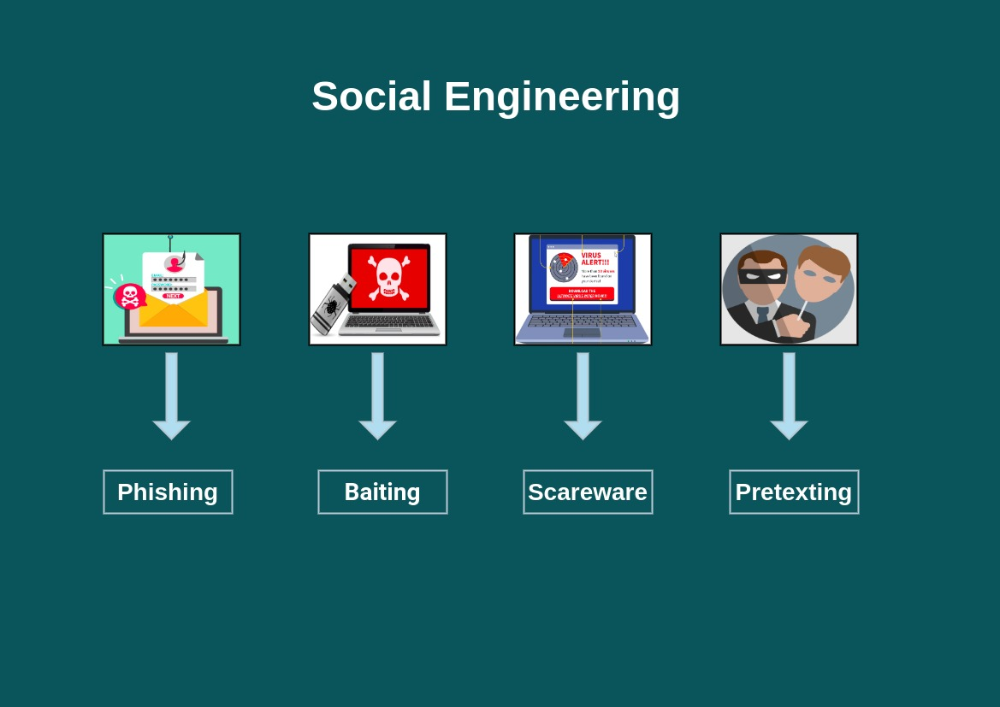
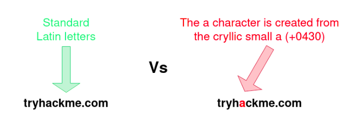

# Introduction to Security Awareness

- Based on `IBM report`, human error were the main reason for `95%` of successful cyber attack

- Everyone has responsibility to be security-awareness

# Social Engineering

 - Social engineering is an attack vector that relies heavily on human interaction

## Type of Social Engineering Attack

## Phishing

- Exploiting weakness in human nature
- eg. `curiosity, jealously, greed and even kindness and willingness to help someone`
-  delivered through email to trick someone into either revealing personal information, credentials or even executing malicious code on their computer

# Hacker trick for phishing 
[#credit - Tryhackme](https://tryhackme.com/room/phishingyl)

#### 1. Typosquatting
- Register domain look very similar to the target domain

- Misspelling - `goggle.com` VS `google.com`
- Additional Period - `go.ogle.com` VS `google.com`
- Switching number for letters - `g00gle.com` VS `google.com`
- Phrasing - `googles.com` VS `google.com`
- Addtional Word - `googleresult.com` VS `google.com`

#### 2. Top Level Domain Alternative

- `google.uk` VS `google.com`

#### 3. Script Spoofing

- Domain Name were made up of Latin characters

## Using Microsoft Office for Phishing

- Some email contain MS office document as attachment (word, excel, PowerPoint)
- Office Document can contain `macros` 
- `macros` can do to run commands and that can cause `malware` to be install on your computer

## Stupid `Myanmar` phishing technique 
- (`smishing` through SMS message or `vishing` through phone)

- Use Remote desktop software such as `anydesk` , `team viewer`

# How to secure from phishing

## 1. Beware of Red Flags for Phishing 
### The Sender Address

- Unexpected or Unusual email
- Someone outside your organization
- misspelled address

### Grammar 

- Grammatical errors may be sign of `phishing`

### Urgency

- Cyber criminals want to take action without thinking, Therefor the create sense of urgency

#### Red flags words 
- `reply immediately`, `urgent` 
- `your account will be deactivated within 24 hours if you do not reply`
- `your data will be lost if you do not login`

### Hyperlinks 

- Never click on link within an email before confirming

#### Attachments

- **Attachments may contain virus, malware, ransomware**
- verify any attachment before opening

## 2. Purchase anti-virus
- Not 100% detection, but help to defend social engineering attack

## 3. Never use `Window 7`
- Window 7 can easily exploit and stopped security support by Microsoft

## 3. Use smart password practices

- `Unique account, unique password`
- Never told your `password` or `password hint` to anyone

## Example YouTube video about password security

You can get password simply ask you ==> [youtube_video](https://youtu.be/opRMrEfAIiI?t=42)

# SE attack Demonstration

1. `sudo setoolkit`
2. choose `social-engineering Attacks` and `create a payload and listener`
3. use `5` ==> `Window Meterpreter Reverse_TCP`
4. Type LHOST IP
5. Copy payload to Window Computer
6. Use Command `screenshot`