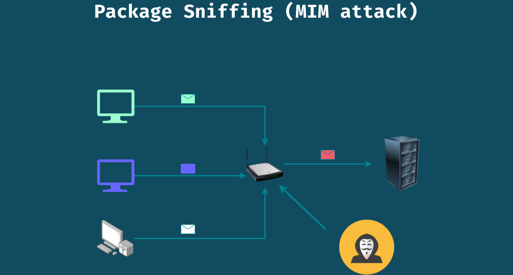

# Internet Safety

# Beware of public network (Public Wifi)

- Public WiFi give ideal opportunities to `Attacker or Hackers`

- The attacker can quickly monitor traffic
- If you were connect to `http` websites and login into an account, the `attacker` can easily find your credentialas (M)

# Demo  (MIM attack)

1. Go to `http://testphp.vulnweb.com`
2. `sudo wireshark`
3. capture the packet and look using filter `http.request.method=="POST"`
